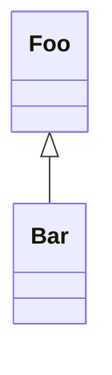

# template-deno-webapp

> Project template for a Deno based webapp with Deno and Rust based WASM library dependencies.

## Project Template Usage

1. Use as a
   [template](https://docs.github.com/en/github/creating-cloning-and-archiving-repositories/creating-a-repository-from-a-template)
   to create a new repository.
2. Update links and references in `README.md`.

## Hosted Webapp Demo

Go to: https://flowscripter.github.io/template-deno-webapp/

## Development

Run: `deno run --allow-net mod.ts`

Test: `deno test -A --unstable`

Lint: `deno fmt mod.ts deps.ts src/ tests/`

Bundle: `deno bundle mod.ts html/mod.bundle.js`

Serve: `cd html && python3 -m http.server 8000` and then...

Verify: Browse to http://127.0.0.1:8000/index.html and check that the browser console displays:

    INFO Hello
    INFO World
    INFO Hello
    INFO World 4

## Functional Tests

Refer to [functional_tests/README.md](functional_tests/README.md)

## Documentation

### Overview

### API

Link to auto-generated API docs for the library:

[API Documentation](https://doc.deno.land/https/raw.githubusercontent.com/flowscripter/template-deno-webapp/main/mod.ts)

## License

MIT © Flowscripter

